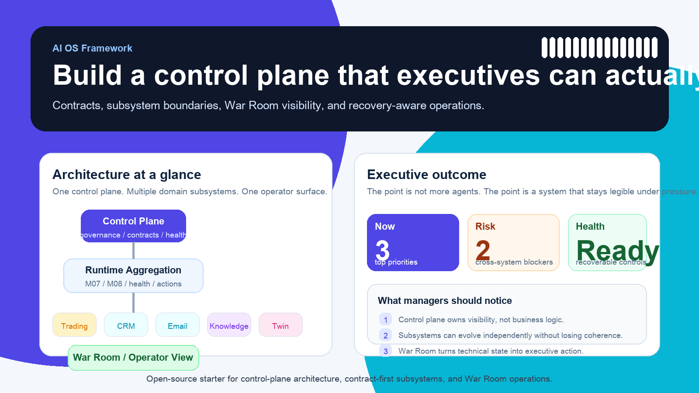
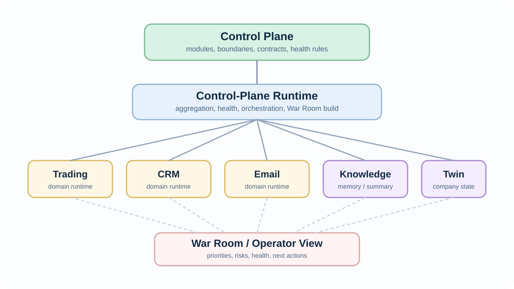
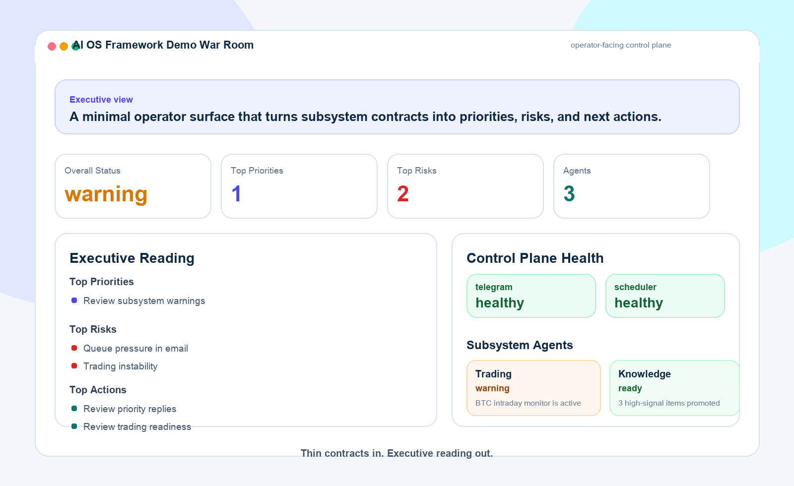

# ai-os-framework



Build your own AI Operating System with:

- one control plane
- multiple domain subsystems
- contract-first integration
- a unified War Room / operator view
- health, observability, and recovery primitives

`ai-os-framework` is an open-source starter kit for builders who want something more structured than a collection of prompts, scripts, and agent sessions.

It is especially useful for founders, operators, and technical leaders who want AI systems that are understandable at the management layer, not just impressive at the prompt layer.

It is designed for systems that need to be:

- modular instead of monolithic
- contract-first instead of prompt-glued
- observable instead of opaque
- portable across local hosts and server environments

It does **not** include private user data, personal CRM data, private email data, knowledge memory contents, or company-specific digital twin logic.

## Why This Exists

Most multi-agent setups break down for the same reason:

- too many isolated tools
- too much hidden state
- too much logic trapped inside sessions
- too little operational visibility

This framework takes a different approach:

1. define one control plane
2. let domain subsystems own their runtime logic
3. require every subsystem to publish explicit contracts
4. aggregate those contracts into a War Room
5. make health, failure, and recovery visible

## What You Get

- a control-plane structure
- subsystem templates
- JSON schemas for contracts
- example subsystem outputs
- a demo War Room snapshot builder
- a minimal dashboard / War Room HTML demo
- a visual demo landing page for executive-facing walkthroughs
- a bootstrap script for first-time setup

## Architecture At A Glance



## Core Design Principles

1. One control plane
2. Multiple domain subsystems
3. Contracts over implicit prompt coupling
4. Operator-facing War Room
5. Observability and recovery as first-class design concerns
6. Portability across host environments

## Repository Layout

```text
ai-os-framework/
├─ demo/
│  └─ war_room/
├─ docs/
├─ framework/
│  ├─ control_plane/
│  ├─ contracts/
│  ├─ health/
│  ├─ war_room/
│  └─ automations/
├─ templates/
├─ examples/
│  ├─ example_trading_subsystem/
│  ├─ example_knowledge_subsystem/
│  └─ example_email_subsystem/
├─ scripts/
├─ Makefile
└─ .env.example
```

## Quickstart

### Option A: one command

```bash
./scripts/bootstrap.sh
```

### Option B: step by step

```bash
cp .env.example .env
python3 scripts/build_demo_war_room_snapshot.py
python3 scripts/validate_contracts.py
```

> **Note:** Core setup requires only Python 3 standard library.
> Image generation scripts require Pillow: `pip install -r requirements-images.txt`

Then open:

- `demo/index.html`

Expected output:

- `output/war_room_snapshot.json`

## Demo

The demo War Room shows how a control plane can consume thin subsystem contracts from:

- trading
- knowledge
- email

without being tightly coupled to subsystem internals.



Open:

- `demo/index.html`
- `demo/war_room/index.html`

Recommended flow:

1. read the root README
2. open the demo landing page
3. open the War Room demo
4. inspect the contracts and templates that produced it

## Included In v1

### Contracts

- `daily_summary.json`
- `war_room_snapshot.json`
- `health_summary.json`
- `module.spec.yaml`

### Templates

- control-plane module template
- subsystem README template
- daily summary template
- health summary template
- War Room snapshot template

### Examples

- example trading subsystem
- example knowledge subsystem
- example email subsystem

## Public vs Private Boundary

This repository should stay public-friendly.

Do **not** put the following here:

- private CRM or email data
- real memory stores or knowledge archives
- personal or company secrets
- live tokens, keys, or host-specific confidential paths
- raw personal digital twin content

Keep those in private repos and expose them only through explicit contracts.

## Recommended Usage Model

Use this framework to:

- create your own control plane
- define your own modules and subsystem boundaries
- publish subsystem contracts
- aggregate them into a War Room
- add health and retry patterns
- evolve modules into subsystems over time

## Docs

- `docs/architecture.md`
- `docs/module-model.md`
- `docs/subsystem-model.md`
- `docs/contract-model.md`
- `docs/portability.md`
- `docs/open_source_scope_v1.md`

## Roadmap

- richer schemas for health and actions
- a stronger dashboard starter
- host-adapter examples for macOS and Linux
- observability starter patterns
- subsystem promotion guide

## License

Apache-2.0

## Contributing

See [CONTRIBUTING.md](CONTRIBUTING.md) for setup instructions, how to add subsystems, and PR guidelines.
